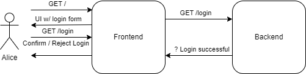

# Kubernetes Intro
## Prerequisites
All of the shell commands are meant to be executed from the repository root folder
### Knowledge prerequisites
- Basic knowledge of Docker
- Basic knowledge of web applications
  - so that you are implementing something better than this code 😉
### Software prerequisites
- Docker
- [kubectl](https://kubernetes.io/docs/tasks/tools/#kubectl)
- [minikube](https://kubernetes.io/docs/tasks/tools/#minikube)

## What is Kubernetes
- Container orchestrator
  - manages containers
- provides a lot of functionality and flexibility
- goes hand in hand with microservice applications

## How to get a cluster
- many different ways
  - Hyperscalers like AWS, Google etc.
    - very expensive
  - [ Free trial clusters for a lot of different hyperscalers](https://github.com/learnk8s/free-kubernetes)
- Locally possible with
  - [kind](https://github.com/kubernetes-sigs/kind)
  - [minikube](https://minikube.sigs.k8s.io/docs/)

In this example we are using a local minikube cluster

Starting a local Kubernetes cluster:
```bash
minikube start
```

## Deploying an application

In this example we want to deploy a web application that handles a user login
> ⚠️ This is for demonstration purposes only. The code is very obviously not for production use

This is the rough service-architecture we want to follow:


The [frontend](src/frontend/) and the [backend](src/backend/) are both implemented in this repository and already have `Dockerfile`s respectively

### Building the images

```bash
docker build -t k8s-intro-frontend src/frontend
docker build -t k8s-intro-backend src/backend
```

### Deploying into the cluster
With the images built, we can deploy the application to our cluster

`kubectl` is our main way to interact with the cluster. With it we interact with resources on the cluster. It uses a standard path to get the configuration file, where the credentials of the clusters are

For our local cluster this is irrelevant, as `minikube` already wrote them to that file

An application is normally deployed in a `Deployment`. It lets us start containers and gives us some more features that are irrelevant for now.

Important is, that it makes sure the application runs as we describe it to be.

> ℹ️ We do no tell Kubernetes what to do. We just define the state how our application should look like

An example deployment is our [Frontend Deployment](deployments/frontend_deployment.yaml).
For a more in-depth explanation of deployments, check out the [Kubernetes Deployment Documentation](https://kubernetes.io/docs/concepts/workloads/controllers/deployment/)

All the different selectors and labels are not really relevant for us at the moment. For simplicities sake they should be all equal for such a basic deployment.

With this deployment Kubernetes sees this as a single application. The work itself is running inside of `Pods` that Kubernetes creates and manages for us.

Before we can deploy our application, we have to tell minikube to pull our images from our local machine, otherwise it would try to get the images from public container registries.

```bash
minikube image load k8s-intro-frontend:latest
minikube image load k8s-intro-backend:latest
```
> ℹ️ This could take some time, or even might not work. [Workaround](https://stackoverflow.com/a/42564211)

Now we can deploy our frontend to the cluster, using: 
```bash
kubectl apply -f deployments/frontend_deployment.yaml
```

If we look at the deployments, we should be seeing it up and running:

```bash
kubectl get deployments      

NAME                  READY   UP-TO-DATE   AVAILABLE   AGE
frontend-deployment   3/3     3            3           20s
```

We can also look under the hood and see the different `Pods` running:

```bash
kubectl get pods
NAME                                   READY   STATUS    RESTARTS   AGE
frontend-deployment-774d7dd5b7-g4cvx   1/1     Running   0          9m50s
frontend-deployment-774d7dd5b7-ksw5s   1/1     Running   0          9m50s
frontend-deployment-774d7dd5b7-r4r2k   1/1     Running   0          9m50s
```

But before we can access this, we have to create a service that points to the `Pods`.
This could look something like [this](deployments/frontend_service.yaml)
For more information on service types, check out the [Kubernetes Service Documentation](https://kubernetes.io/docs/concepts/services-networking/service/)

We can deploy it exactly like any other resource, with:
```bash
kubectl apply -f deployments/frontend_service.yaml
```

We can see it with:
```bash
kubectl get services

NAME               TYPE        CLUSTER-IP       EXTERNAL-IP   PORT(S)        AGE
frontend-service   NodePort    10.108.200.225   <none>        80:32555/TCP   3m30s
kubernetes         ClusterIP   10.96.0.1        <none>        443/TCP        117m
```

Normally with a `LoadBalancer`-Service, we would have an external IP. But those are implemented by the cloud-infrastructure where the cluster is located, which means we cannot use it locally.

The most common way of exposing a service to the internet is using an `Ingress`-controller with respective rules to forward traffic to a service. This is also just feasable for cloud-clusters. For more information, check out the [Kubernetes Ingress Documentation](https://kubernetes.io/docs/concepts/services-networking/ingress/)

`NodePort` type gives us the opportunity to access our service from our machine, with the help of `minikube`:
```bash
minikube service frontend-service --url
http://127.0.0.1:44135
❗  Because you are using a Docker driver on linux, the terminal needs to be open to run it.
```

When we open our browser, we can see our application🥳

Now we want to deploy our backend and connect our frontend to it:

```bash
kubectl apply -f deployments/backend_deployment.yaml
kubectl apply -f deployments/backend_service.yaml
```

In the [`frontend_deployment.yaml`](deployments/frontend_deployment.yaml) we specified the `BACKEND_URL` as the service name of our backend service.

Kubernetes allows us to use the service-names as hostnames inside of the cluster. This is really useful for connecting services, as we do not have to care about changing IPs etc.

If we head on over to the website again, and enter credentials, we get the according responses.

With this deployment configuration our `backend-service` is not exposed to the public, but only from `Pods` inside the cluster

## Observation of a cluster

A really helpful tool is [`k9s`](https://k9scli.io/)!
It is an CLI that can do everything that `kubectl` can, but makes it more accessible and interactive

When executed, we can see our deployments when we type `:deploy` and enter

Selecting our frontend-deployment and pressing `l` gives us the logs of all of the `Pods` of that `Deployment`
